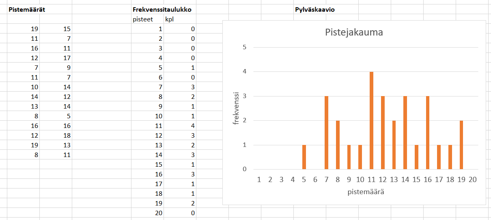

# Tilastolliset jakaumat

Tilastollisten muuttujien arvot ja niiden lukumäärät eli frekvenssit muodostavat tilastollisen jakauman. Jakauma voi olla diskreetti tai jatkuva. Tilastolliselle jakaumalle voidaan laskea erilaisia tunnuslukuja. Tunnuslukujen avulla saadaan hyödyllistä tietoa suuresta aineistosta tiiviissä muodossa. 

## Diskreetit jakaumat

Jakauma on diskreetti, jos tilastomuuttuja voi saada vain rajallisen määrän arvoja. Tilastollinen muuttuja voi olla esimerkiksi kokeesta saatu pistemäärä, ihmisen kengännumero tai sadepäivien määrä tietyn kuukauden aikana. Tilastollinen muuttuja voi olla muukin kuin lukuarvo, esimerkiksi henkilön äidinkieli tai kotikunta.

**Esim.** Kokeeseen osallistui 28 oppilasta. Alla olevassa kuvassa vasemmalla on oppilaiden kokeesta saamat pisteet. Pistemäärä on aineiston tilastollinen muuttuja. Keskellä pisteet on esitetty frekvenssitauluna tai -taulukkona. Frekvenssi kuvaa, kuinka monta kertaa jokin pistemäärä esiintyy arvosanaluettelossa. Frekvenssitaulukon sisältö voidaan esittää pylväskaaviona. Pylvään korkeus kertoo, kuinka moni oppilas sai tietyn pistemäärän.

## Jatkuvat jakaumat

Jakauma on jatkuva, jos tilastollinen muuttuja voi saada mitä tahansa arvoja tietyltä väliltä. Mahdollisuuksia on periaatteessa ääretön määrä, mutta käytännössä mittaustarkkuus rajoittaa mahdollisia muuttujien arvoja. Tällaisia muuttujia ovat esimerkiksi ihmisen paino, keihäänheiton tulos tai etäisyys työpaikalle. Muuttujien arvojen jakauma voidaan muodostaa jakamalla arvot sopiviin luokkiin.

**Esim.** Testattiin 30 henkilön reaktioaikaa. Mittaus tehtiin mikrosekunnin tarkkuudella. Tulokset ovat ensimmäisessä taulukossa. Tulokset on järkevää esittää sopivasti luokiteltuna, kuten jälkimmäisessä frekvenssitaulukossa. Frekvenssitaulukon voi esittää pylväskaaviona.

|mittaus|t (µs)|mittaus|t (µs)|mittaus|t (µs)|
|-------|------|-------|-----|--------|-------|
|1|731|11|770|21|1060|
|2|716|12|954|22|832|
|3|782|13|931|23|911|
|4|1042|14|1020|24|705|
|5|603|15|885|25|901|
|6|1015|16|723|26|985|
|7|1067|17|621|27|852|
|8|643|18|693|28|1092|
|9|1017|19|648|29|705|
|10|897|20|1093|30|941|

