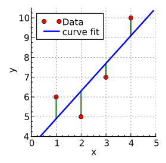
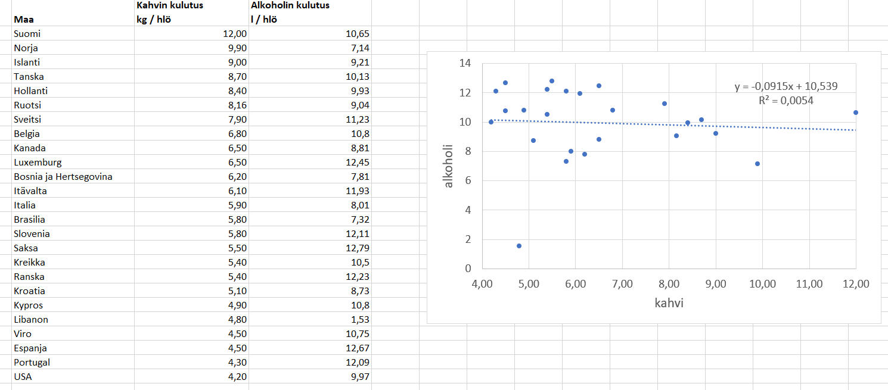

# Lineaarinen malli

Lineaarinen malli tarkoittaa suoran yhtälöä $y=ax+b$, missä kulmakerroin $a$ kuvaa suoran jyrkkyyttä, ja leikkausvakio $b$ on muuttujan arvoa $0$ vastaava funktion arvo. Laskentaohjelmilla voidaan etsiä kertoimet $a$ ja $b$ siten, että datapisteiden ja mallin antamien lukujen etäisyyksien toisten potenssien summa on mahdollisimman pieni. Puhutaankin pienimmän neliösumman (PNS) sovituksesta. Pienimmän neliösumman periaate on esitetty seuraavassa kuvassa.

Kuva: [Krishnavedala - Own work](https://commons.wikimedia.org/w/index.php?curid=15462765), CC BY-SA 3.0

PNS-sovitus onnistuu tietokoneilta näppärästi matriisilaskennan avulla. Tarkemmin menetelmästä on kerrottu esimerkiksi [täällä](https://luma-lapinamk.github.io/minna-diffint/pns_sovitus.html). Menetelmässä minimoidaan oikeiden pisteiden ja suoran pisteiden etäisyyksien neliöiden summaa differentiaalilaskennan avulla. Differentiaalilaskenta yleensäkin soveltuu ongelmiin, joissa halutaan löytää jonkin asian pienin (tai suurin) mahdollinen arvo. Differentiaalilaskennan laskutoimituksista muodostuu yhtälöpari, jossa tuntemattomina ovat suoran vakiot $a$ ja $b$, ja muut luvut lasketaan datapisteistä. Yhtälöparin tietokone puolestaan ratkaisee helposti matriisiyhtälönä, vaikka esimerkiksi Excelin käyttäjä ei itse näitä laskutoimenpiteitä näe.

Lineaariselle mallille voidaan laskea ns. selityskerroin $R^2$. Se on lukujen 0 ja 1 välillä. Mitä korkeampi on selityskerroin, sitä luotettavammin voidaan sanoa, että muuttujat $x$ ja $y$ ovat lineaarisessa suhteessa toisiinsa. Selityskerroin on ns. korrelaatiokertoimen $R$ toinen potenssi. Korrelaatiokerroin voi saada arvoja lukujen -1 ja 1 väliltä. Luvun itseisarvo kertoo siitä, missä määrin datapisteet $x$ ja $y$ riippuvaisia toisistaan, ja luvun etumerkki kertoo, kasvavatko luvut yhtä aikaa vai kasvaako toinen luku, kun toinen pienenee.

Excelissä lineaarinen sovitus voidaan tehdä joko LINREGR (LINEST) -funktiolla tai tekemällä datasta pistekaavio ja valitsemalla kaavion asetuksista pistejoukkoon lineaarinen trendiviiva. Kummallakin toiminnolla saa suoran yhtälön lisäksi selville selityskertoimen. Korrelaatiokertoimen voi laskea myös suoraan datasta funktiolla KORRELAATIO (CORRELATION). Yleisesti pienillä otoksilla korrelaatiokertoimet, joiden itseisarvo on suurempi kuin 0.7, ovat merkittäviä. Isoilla otoksilla itseisarvoltaan pienemmätkin korrelaatiokertoimet voidaan tulkita merkitseviksi.

Alla olevan kuvan dataan voidaan hyvin sovittaa lineaarinen malli. Selityskerroin on lähellä yhtä. Data kuvaa Rovaniemellä asemakaava-alueella sijaitsevien pientalojen kauppahintojen mediaaniarvoja vuosina 1002-2021. Datan lähde: [Maanmittausmittaus, 19.5.2022](https://www.maanmittauslaitos.fi/tietoa-maanmittauslaitoksesta/organisaatio/tilastot).
 

Seuraavaan dataan lineaarinen malli ei sovellu yhtä hyvin. Taulukossa on kahvin ja alkoholin kulutus henkilöä kohden eri maissa (lähteet: [kahvi, 19.5.2022](https://kahvipiiri.fi/artikkelit/kahvin-kulutus/), [alkoholi 19.5.2022](https://worldpopulationreview.com/country-rankings/alcohol-consumption-by-country)). Onkohan kahvin ja alkoholin kulutuksella yhteyttä toisiinsa?

Korrelaatiokertoimeksi saadaan Excelillä -0.07. Sekä korrelaatiokerroin että selityskerroin ovat itseisarvoltaan hyvin pieniä. Negatiivinen korrelaatio näkyy siten, että suora on laskeva: mitä vähemmän maassa kulutetaan kahvia, sitä enemmän siellä kulutetaan alkoholia. Selityskerroin on kuitenkin niin pieni, ettei yhteyttä voida sanoa olevan olemassa.
 

Korrelaatiokertoimen arvo reagoi hyvin herkästi havaintoarvoihin, jotka poikkeavat joko $x$- tai $y$ -arvoltaan suuresti muusta aineistosta. Tällöin pitää harkita, pitäisikö poikkeavat arvot poistaa aineistosta, tai onko aineisto muutenkaan käyttökelpoista. Ehkä kahvin ja alkoholin kulutuksen yhteyskin vahvistuisi, jos Libanon jätettäisiin tarkastelun ulkopuolelle.

Seuraavassa kuvassa on muuten keskenään sama aineisto, mutta oikeanpuoleisesta kuvasta on poistettu ne pisteet, jotka on vasemmanpuoleisessa kuvassa rengastettu punaisella. Kuvaajissa $x$-akselin arvot ovat lumisateen voimakkuuksia (mm/h) ja ja $y$-akselin arvot kuvaavat sitä, miten lumisade vaimentaa mm. auton havaintolaitteissa käytettävän infrapunasäteilyn kulkua. Suoran yhtälö ja selityskerroin muuttuvat huomattavasti, kun datasta poistetaan poikkeuksellisen voimakkaat lumipyryt. Data on peräisin [WinterSim](https://wintersim.fi/)-hankkeesta. 

