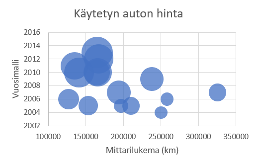

# Kahden muuttujan lineaarinen malli

Joskus yksi muuttuja ei riitä selittämään ilmiötä. Esimerkiksi asunnon vuokraan vaikuttaa ainakin asunnon koko, sijainti ja kunto, ehkäpä myös saunan tai parvekkeen olemassaolo. Keskitytään tässä kahden muuttujan malliin. Tällöin voitaisiin tutkia esimerkiksi, miten asunnon pinta-ala ja etäisyys keskustasta vaikuttavat sen vuokraan, mutta jätettäisiin muut asiat huomiotta.

Kahden muuttujan lineaarinen malli on muotoa $y=ax_1+bx_2+c$. Seuraavassa esimerkissä tarkastellaan, miten mittarilukema ja vuosimalli vaikuttavat käytetyn auton hintaan, kun autot ovat muuten samanlaisia. Taulukossa on (kuvitteellisia) autojen tietoja. Muuttujana $x_1$ on mittarilukema (km) ja muuttuja $x_2$ on vuosimalli.

|$x_1$|$x_2$| $y$ (€)|$x_1$|$x_2$| $y$ (€)|$x_1$|$x_2$| $y$ (€)|
|-----|-----|--------|-----|-----|--------|-----|-----|--------|
|238000|2009|7900|258000|2006|4470|166000|2010|9500|
|194000|2007|7900|325000|2007|5900|127000|2006|6900|
|165000|2010|8700|197000|2005|4800|153000|2005|6500|
|135000|2011|9200|250000|2004|4300|210000|2005|5900|
|167000|2012|9900|141000|2010|10000|165000|2013|10500|

Vasemmassa kuvassa on tarkasteltu hintaa pelkästään vuosimallin funktiona, oikeassa taas pelkästään mittarilukeman funktiona. Kummallakin ominaisuudella on selvästi vaikutusta. Yhteisvaikutusta ei kuitenkaan voi päätellä kuvaajista, joissa ominaisuuksia on tarkasteltu erikseen, vaan on tehtävä kahden muuttujan mallin sovitus. 
 

Excelin LINREGR -funktiolla voidaan etsiä kertoimet myös sellaiselle lineaariselle mallille, joka on muotoa $y=ax_1+bx_2+c$. Mallin rakentamista harjoitellaan oppitunnilla. Analyyttisen geometrian mielessä tällainen yhtälö kuvaa tasoa, ei suoraa. Niinpä mallia ei voikaan esittää piirtämällä datan joukkoon suora. Jotkut ohjelmat kuitenkin osaavat tehdä mallia vastaavan kolmiulotteisen kaavion, jossa mallin mukaan laskettu $y$:n arvo esitetään pinnan korkeuden avulla. 

Jos alkuperäisen datan haluaa esittää kaksiuloitteisena kuvaajana, pitää luvun $y$ suuruus esittää vaikkapa datapisteen koon tai värin avulla, sillä molemmat kuvaajan akselit ovat jo varattu muuttujille $x_1$ ja $x_2$. Alla on edellisen kuvan kaksi datasarjaa yhdistettynä kuplakaavioksi. Mitä suurempi on kuplan koko, sitä enemmän auto maksaa. Kuvassa ei näy dataan sovitettua kahden muuttujan lineaarista mallia.

